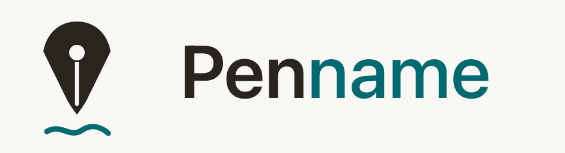
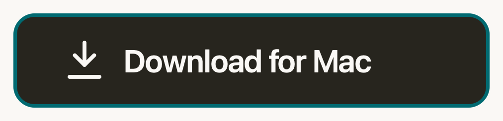
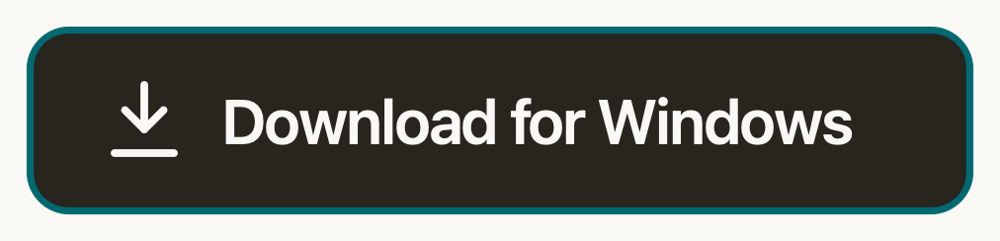
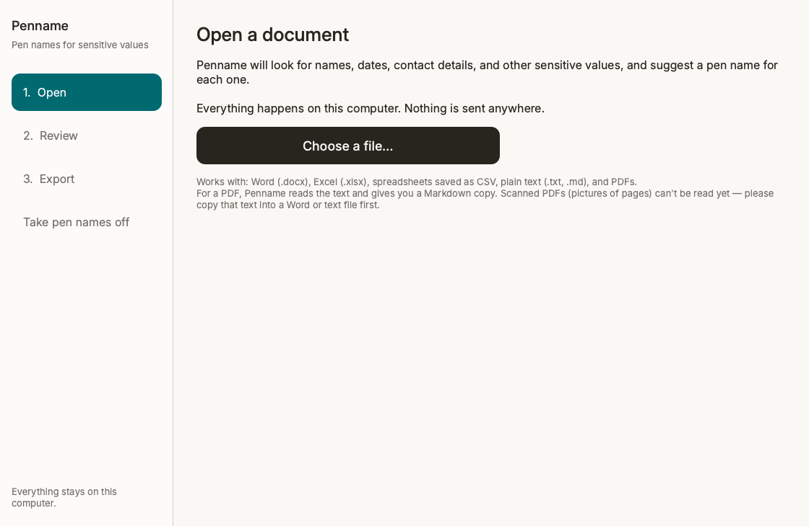
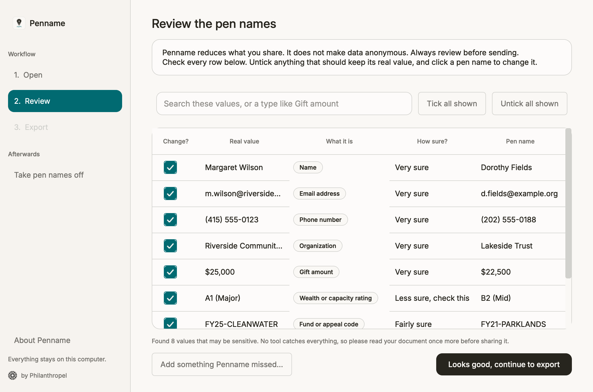
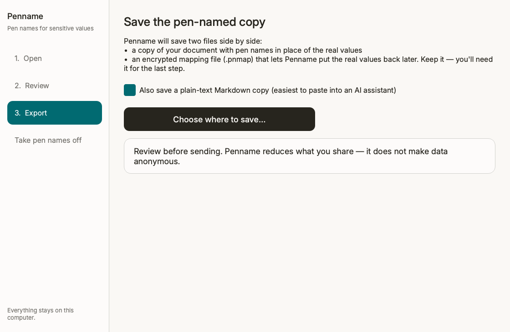
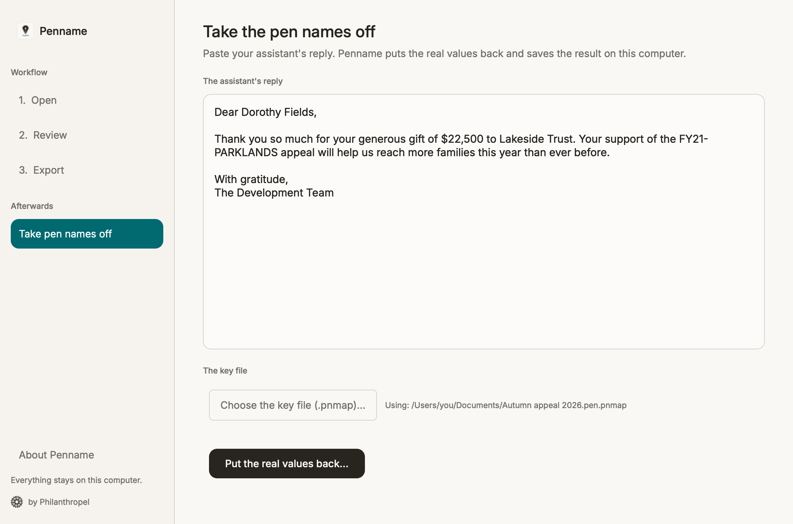

<p align="center">
  
</p>

**Give the private details in your donor files a "pen name" before you share them
with an AI assistant — then swap the real details back afterwards. Everything
happens on your own computer.**

### Why it matters

AI assistants — ChatGPT, Claude, Copilot, and the command-line AI agents many
teams now use — are genuinely useful for drafting letters, tidying spreadsheets,
and summarising notes. But **anything you paste into one leaves your computer**
and goes to the company that runs the AI, where it can be stored and, depending
on the service, used to train their models. Once your donors' real names, gifts,
and contact details are in someone else's system, you can't take them back.

Using AI responsibly — the same due diligence you'd apply to any tool that
handles people's data — means **sharing only what you need to**. Penname is the
simple step in between: it swaps the sensitive details for realistic stand-ins so
you can get the AI's help **without** handing over the real people behind the
data, then restores the real values afterwards. It's a small habit that keeps you
on the right side of your donors' trust — and your data-protection obligations.

<p align="center">
  <a href="https://github.com/AnmolPSingh/penname/releases/latest/download/Penname.dmg"></a>
  &nbsp;&nbsp;
  <a href="https://github.com/AnmolPSingh/penname/releases/latest/download/Penname-Setup.exe"></a>
</p>
<p align="center"><sub>A free, open-source tool for nonprofits, by <b>Philanthropel</b> · runs entirely on your computer · <a href="../../releases/latest">all downloads &amp; checksums</a></sub></p>

Penname is a free tool for fundraisers and nonprofit teams. If you'd like help
from an AI assistant (like ChatGPT, Claude, or Copilot) to write a thank-you
letter, tidy a spreadsheet, or summarise your notes — but you don't want to hand
over your donors' real names, gifts, and contact details — Penname stands in the
middle. It swaps the sensitive bits for realistic stand-ins ("pen names"), you
do your work with the AI, and then Penname puts the real details back.

Nothing you open in Penname is ever sent over the internet. It all stays on your
machine.

---

## What Penname does, in plain terms

Say your file contains this line:

> Margaret Wilson gave $25,000 to the FY25-CLEANWATER appeal. Reach her at
> m.wilson@homemail.com or (415) 555-0123.

Penname turns it into something safe to share:

> Dorothy Fields gave $31,500 to the RD04-BRIGHTPATH appeal. Reach her at
> d.fields@example.org or (202) 555-0876.

You paste the safe version into your AI assistant. When it replies, you paste the
reply back into Penname, and it restores the real names and details in the result
— saved as a file on your computer.

It finds and replaces things like:

- **Names** of people and organisations
- **Email addresses and phone numbers**
- **Home and mailing addresses**
- **Gift amounts and giving histories**
- **Wealth and capacity ratings**
- **Fund, campaign, and appeal codes**
- **Constituent / donor ID numbers**
- **Dates**

---

## Is my donors' information safe?

Wherever you work in the world, the details in donor records — names, contact
details, giving histories, wealth information — are **personal, sensitive
information**, and your donors trust you to look after it. Privacy and
data-protection laws reflect that almost everywhere: the EU and UK (**GDPR**),
the United States (state privacy laws such as **CCPA/CPRA**, and sector rules),
Canada (**PIPEDA**), Brazil (**LGPD**), South Africa (**POPIA**), India (**DPDP
Act**), Australia (**Privacy Act**), and many more across both the Global North
and Global South. Sharing raw donor data with an outside AI service can put that
trust — and your obligations — at risk.

Penname helps you share **less**.

**But please read this carefully:** Penname **reduces** the personal information
you share. It does **not** make your data anonymous, and it will **not** catch
every sensitive detail. Even after Penname has done its work, the result is still
personal data — because the link back to the real values exists on your computer.
No automatic tool is perfect, which is why Penname always asks you to **look over
everything and review before sending.** You are always in control.

Two promises we keep:

- **Nothing leaves your computer.** No internet connection is used, ever — no
  tracking, no accounts, no cloud. All the smarts are built into the app.
- **The "key" is locked away.** The file that links pen names back to real values
  is encrypted, with its key kept in your computer's secure keychain. It's never
  stored in plain, readable form.

---

## How to install Penname

### 1. Download it

Click the button for your computer at the top of this page — **Download for
Mac** (a `.dmg`) or **Download for Windows** (a `Setup.exe` installer). You can
also pick a file, including plain `.zip` versions, from the
[Releases page](../../releases/latest).

**On a Mac:** open the downloaded `Penname.dmg` and drag **Penname** into your
**Applications** folder.

**On Windows:** run the downloaded **`Penname-Setup.exe`** and follow the short
installer — it adds Penname to your Start menu.

### 2. Open it for the first time

Penname is a free, community project, so it isn't registered with Apple or
Microsoft the way big paid software is. That's normal — but it means your
computer will show a caution message the **first** time you open it. Here's how
to get past it (you only do this once):

**On a Mac**
1. In your Applications folder, **right-click** (or Control-click) the Penname
   icon and choose **Open**.
2. A message appears asking if you're sure — click **Open**.
3. If macOS still won't open it, go to **System Settings → Privacy & Security**,
   scroll down, and click **Open Anyway** next to Penname.

> Tip: right-click → Open works even when a plain double-click doesn't. After the
> first time, you can open Penname normally.

_[Screenshot of the Mac "are you sure you want to open it" message goes here —
capture this on your Mac the first time you open Penname.]_

**On Windows**
1. When you run `Penname-Setup.exe`, a blue "Windows protected your PC" box may
   appear. Click **More info**, then **Run anyway**.
2. Finish the installer, then open **Penname** from the Start menu.

_[Screenshot of the Windows "More info / Run anyway" message goes here — capture
this on your PC the first time you open Penname.]_

> Prefer package managers? On a Mac you can also install with Homebrew once a
> tap is set up (no warning to click through); on Windows, via Scoop or winget.
> Ask if you'd like these set up.

### 3. (Optional) Check your download is genuine

Each release lists a short "checksum" next to every file — a fingerprint you can
compare to make sure your download wasn't tampered with. If you're comfortable
with this step, see [Verifying your download](#verifying-your-download) near the
bottom. If not, you can safely skip it.

---

## How to use Penname — step by step

### Step 1 — Open your document

Click **Choose a file…** and pick the document you want to clean up — a Word
file, an Excel spreadsheet, a CSV export, a plain-text file, or a PDF.



### Step 2 — Review the pen names (the important step)

Penname shows you **every** value it found and the pen name it suggests. This is
your chance to check its work:

- **Untick** any row that should keep its real value.
- **Click a pen name** to change it to something you prefer.
- Use **Add something Penname missed…** to catch anything it didn't find.

Please read through the whole document once more here — no tool catches
everything, and this review step is what keeps you in control.



### Step 3 — Save the safe copy

Click **continue to export** and choose where to save. Penname saves two files:
a copy of your document with pen names in place, and a small **encrypted key
file** (ending in `.pnmap`) — keep that one, you'll need it for the last step.

Now paste the pen-named copy into your AI assistant and do your work.



### Step 4 — Take the pen names off

When your AI assistant replies, copy its reply, come back to Penname's **Take pen
names off** tab, and paste it in. Choose the key file (`.pnmap`) you saved
earlier, and Penname will restore the real names and details — saved as a file on
your computer.



That's the whole loop: **Open → Review → Save & share → Take pen names off.**

---

## Good to know

- **Works with:** Word (`.docx`), Excel (`.xlsx`), CSV spreadsheets, plain text
  (`.txt`, `.md`), and PDFs. For a PDF, Penname reads the text and hands you a
  Markdown copy.
- **Scanned PDFs** (pictures of pages) can't be read yet — if your PDF is a scan,
  copy its text into a Word or text file first.
- **Penname doesn't do the AI part.** You still paste into whichever AI assistant
  you already use; Penname just protects what goes in and restores what comes out.
- **If something looks wrong,** nothing is lost — your original file is never
  changed. Just start again.

---

## For developers

Penname is open source (Apache-2.0). The engine is a pure Python library with the
desktop app, a command-line tool, and an optional MCP server all sitting on top.

```bash
uv sync            # install dependencies (Python 3.11+)
uv run pytest      # run the test suite — round-trip integrity is the gate
uv run python -m penname.cli.main pseudonymize letter.txt --mapping letter.pnmap
uv run python -m penname.cli.main reverse response.txt --mapping letter.pnmap -o restored.txt
```

> If your project folder path contains a space, `uv`'s editable install writes a
> `.pth` the interpreter skips, so the `penname` console command may report
> "No module named 'penname'". Run `uv run python -m penname …` instead, or clone
> to a path without spaces. Installed releases and CI are unaffected.

### Detection backends

Detection combines Microsoft Presidio (regex patterns for emails, phones,
amounts, IDs, fund codes) with spaCy for named entities. An optional **GLiNER**
backend adds higher-recall detection for names, organisations, and places.

The downloadable apps ship Presidio + spaCy only — bundling GLiNER pulls in
PyTorch, which pushes the app past GitHub's 2 GB release limit. GLiNER is a
source-install extra; the engine uses it when present and falls back to
Presidio + spaCy when it isn't:

```bash
uv sync --extra gliner                              # install GLiNER + torch
uv run python -m penname.core.detect.gliner_model   # fetch the model (one-time)
```

The model is only ever downloaded by that fetch step; at runtime it loads from
local files with the network disabled. (GLiNER can't be installed on Intel Macs —
`onnxruntime` no longer ships Intel-Mac wheels — so on those the app runs
Presidio + spaCy only.)

### Optional MCP server (off by default)

Penname ships an MCP server so a local AI agent can pseudonymize documents and
take pen names off replies. It is **disabled by default**:

```bash
python -m penname.mcp.config enable    # opt in (writes ~/.penname/settings.json)
penname-mcp                            # starts the server over stdio
```

It exposes two tools: `pseudonymize_document` (returns file paths and counts,
never raw content) and `reverse_to_file` (writes the restored text to a local
file and returns **only** a success flag and the path — restored donor data is
never returned into the model's context).

### Verifying your download

Every release lists a **SHA-256 checksum** next to each file and a **build
provenance attestation** proving the file was built by this repository's release
workflow. To check your download matches:

```bash
# macOS
shasum -a 256 Penname-macos.zip
# Windows (PowerShell)
Get-FileHash Penname-windows.zip -Algorithm SHA256
```

Compare the result to the `.sha256` file published with the release.

---

## A free, open-source tool for nonprofits, by Philanthropel

<p align="center">
  
</p>

Penname is made and maintained by **Philanthropel**, and given freely to the
nonprofit and philanthropy community.

**© 2026 Philanthropel Limited.**

### License & trademarks

- **The code is open source**, licensed under the **Apache License, Version 2.0**
  (see [`LICENSE`](LICENSE)). You may use, modify, and redistribute it under those
  terms.
- **The names and logos are not.** "Penname" and "Philanthropel", the Penname
  pen-nib mark, and the Philanthropel logo are **trademarks of Philanthropel
  Limited, all rights reserved** (see [`NOTICE`](NOTICE)). The open-source
  license covers the source code only — it does not grant any right to use these
  names or logos, so please don't ship forks or other products under the Penname
  or Philanthropel name.

### Disclaimer & responsible use

- **Penname helps, but it does not guarantee.** It reduces the personal data you
  share; it does **not** remove all of it and does **not** make your data
  anonymous. Always review the results before sharing them.
- **Provided "as is".** Penname comes with **no warranty of any kind**, and
  **Philanthropel Limited is not liable** for how you use it or for any outcome
  of its use (this restates the Apache-2.0 license, sections 7–8).
- **You are responsible.** You are responsible for reviewing Penname's output and
  for meeting your own privacy and data-protection obligations under the laws
  that apply to you.
- **Not advice.** Penname is a tool, not legal or compliance advice.
- **Lawful use only.** Do not use Penname for any unlawful purpose.

Penname runs entirely on your computer and makes no network connections, so no
information you process with it is ever sent to Philanthropel or anyone else.
