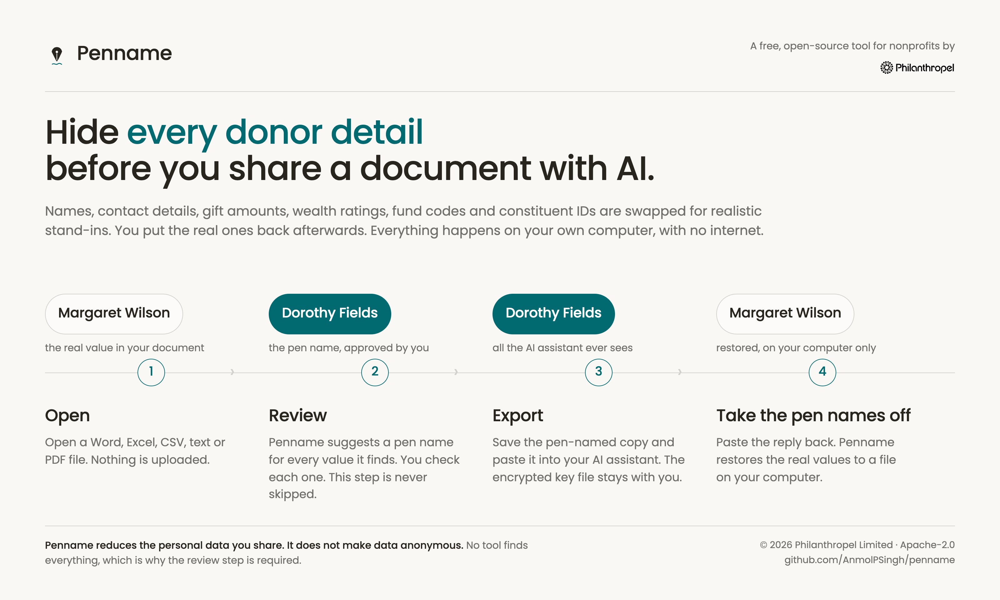
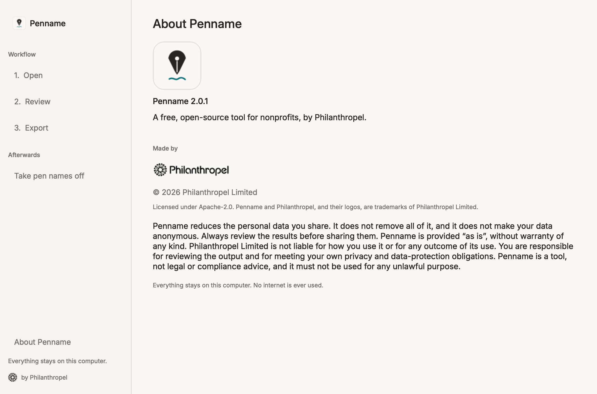

<p align="center">
  
</p>

<p align="center">
  <sub>A free, open-source tool for nonprofits by</sub><br>
  
</p>

<h3 align="center">Hide every donor detail before you share a document with AI.</h3>

<p align="center">
Penname takes the private things out of your documents so you can safely ask an AI<br>
assistant for help, then puts them back when you're done.<br>
It runs on your own computer. It never uses the internet.
</p>

---

## What Penname does

You have a donor letter, a spreadsheet, or a report. You'd like ChatGPT, Claude,
or Copilot to help you rewrite it, summarise it, or tidy it up. But you can't
paste it in, because it's full of things you must not share.

Penname fixes that in four steps:

1. **You open your document in Penname.**
2. **Penname finds the private details** and suggests a stand-in for each one.
   Margaret Wilson becomes Dorothy Fields. $25,000 becomes $22,500.
3. **You check the list** and change anything you like, then save a safe copy.
   That's the copy you paste into your AI assistant.
4. **You paste the AI's reply back into Penname**, and the real details return.

**What counts as a private detail?** Names of donors, staff and trustees.
Organisations. Email addresses, phone numbers and postal addresses. Gift amounts
and giving histories. Wealth and capacity ratings. Fund, campaign and appeal
codes. Constituent IDs.

---

## What you can open

| You can open | What you get back |
|---|---|
| **Word** (`.docx`) | A Word file |
| **Excel** (`.xlsx`) | An Excel file |
| **CSV** spreadsheets | A CSV file |
| **Plain text** (`.txt`, `.md`) | A text file |
| **PDF** | A text copy you can paste anywhere |

Penname also knows the export formats of the systems you already use, including
**Raiser's Edge NXT, Salesforce NPSP, DonorPerfect, Bloomerang** and
**Little Green Light**.

> **Scanned PDFs won't work yet.** If your PDF is a photograph or scan of a page
> rather than real text, Penname can't read it. Copy the text into a Word or text
> file first.

---

## Nothing ever leaves your computer

This is the part that matters most, so here it is plainly:

- **Penname does not use the internet.** Not to check for updates, not to send
  statistics, not for anything. You can turn your Wi-Fi off and it works exactly
  the same.
- **Your documents are never uploaded.** They are opened, read and saved on your
  own machine, and nowhere else.
- **Nothing is sent to Philanthropel.** We cannot see your documents, your
  donors, or even that you are using Penname.
- **The key file is locked.** The file that lets you restore the real details is
  encrypted, and its password lives in your computer's own keychain.
- **You can check this yourself.** All the code is public, and everything Penname
  needs is included in the download.

The only moment anything leaves your computer is when **you** choose to paste the
safe copy into your AI assistant. And by then the private details are gone.

---

## Data protection rules, wherever you work

Penname helps you do one thing that nearly every privacy law in the world asks
for: **share less personal data than you otherwise would.**

Under UK and EU GDPR this is called **pseudonymisation**, and the law names it
directly — Article 4(5) defines it, and Article 32 lists it as an appropriate
security measure. Elsewhere it goes by other names, but the principle is the
same: don't hand over personal details you don't need to hand over.

| Where you work | The rules that apply | How Penname helps |
|---|---|---|
| **United Kingdom** | UK GDPR, Data Protection Act 2018 | Pseudonymisation is a recognised safeguard |
| **European Union / EEA** | GDPR | Named in Article 32 as a security measure |
| **United States** | State privacy laws — CCPA/CPRA in California, plus Virginia, Colorado, Connecticut, Texas, Utah and more | Less personal information disclosed to a third-party service |
| **Canada** | PIPEDA | Limits what is disclosed to others |
| **Australia** | Privacy Act 1988 — especially APP 8, on sending data overseas | An AI assistant is usually an overseas disclosure |
| **India** | Digital Personal Data Protection Act 2023 | Reduces the personal data processed |
| **South Africa** | POPIA | Supports minimality and security safeguards |
| **Brazil** | LGPD | Supports data minimisation |
| **Kenya / Nigeria** | Data Protection Act 2019 / NDPA 2023 | Reduces what is shared with processors |

> ### Please read this part
>
> **Penname does not make you compliant, and it does not make your data
> anonymous.** Because the real details can be restored, the safe copy still
> counts as personal data under GDPR and most similar laws. What Penname does is
> reduce how much personal data you share, which is a genuine and recognised
> safeguard — not a get-out.
>
> **You are still responsible** for reviewing what Penname produces and for
> meeting the rules that apply to you. Penname is a tool, not legal advice. If
> your work involves health, financial, or children's data, check with whoever
> advises you before using any AI assistant.

---

## Installing Penname

**Please read this before you download.** Penname is free, open-source software,
so it isn't registered with Apple or Microsoft the way paid software is. Your
computer will warn you the first time. That's expected, and here's exactly how to
get past it. **You only do this once.**

### On a Mac — 4 steps

1. Click **Download for Mac** below. You'll get a file called `Penname.dmg`.
2. Open it. A window appears with the Penname icon and an **Applications**
   folder. **Drag Penname onto Applications.**
3. Now one extra step. Open the **Terminal** app — press <kbd>⌘</kbd> +
   <kbd>Space</kbd>, type `Terminal`, press <kbd>Enter</kbd>. Copy the line
   below, paste it into the black window, and press <kbd>Enter</kbd>:

   ```bash
   xattr -dr com.apple.quarantine /Applications/Penname.app
   ```

   It will look like nothing happened. That's correct. You can close Terminal.
4. Open **Penname** from your Applications folder. It will open normally from now
   on.

> **What did that command do?** It told your Mac "I downloaded this on purpose."
> Nothing more. It doesn't change Penname or give it any new powers.
>
> Right-clicking and choosing **Open** used to work instead of step 3. Apple
> removed that in macOS 15, so the Terminal step is now the reliable way.

### On Windows — 3 steps

1. Click **Download for Windows** below. You'll get `Penname-Setup.exe`.
2. Run it. A blue box may say **"Windows protected your PC."** Click
   **More info**, then **Run anyway**.
3. Finish the installer. Penname is now in your Start menu.

### Why does my computer warn me at all?

Software companies pay Apple and Microsoft every year to have their apps
recognised. Penname is given away free, so it doesn't carry that registration
yet, and your computer says so rather than staying silent about it.

The warning means *"nobody has paid to vouch for this"* — not *"this is
dangerous."* If you'd rather be certain, every release publishes a **SHA-256
checksum** and a **build provenance attestation** proving the file was built from
this public code, untouched by anyone. See
[Verifying your download](#verifying-your-download).

---

## Download

<p align="center">
  <a href="https://github.com/AnmolPSingh/penname/releases/latest/download/Penname.dmg"></a>
  &nbsp;&nbsp;
  <a href="https://github.com/AnmolPSingh/penname/releases/latest/download/Penname-Setup.exe"></a>
</p>

<p align="center"><sub>Free forever · Runs entirely on your computer · © 2026 Philanthropel Limited · <a href="../../releases/latest">all downloads &amp; checksums</a></sub></p>

> **Mac users:** Penname currently requires a Mac with **Apple Silicon** (M1, M2,
> M3 or M4). To check, click the  menu → **About This Mac**. If it says
> "Intel", Penname won't run on your machine yet — please
> [tell us](https://github.com/AnmolPSingh/penname/issues) so we can prioritise it.

---

## How Penname works

<div align="center">
  
</div>

---

## Using Penname, step by step

### Step 1 — Open your document

Drag your file onto the window, or click **Choose a file**. Penname reads it and
looks for private details.

The first document you open each day takes a little longer, because Penname is
starting up its language tools. You'll see a progress bar while it works.


### Step 2 — Check the list (the important step)

This is the screen that matters. Penname shows **every** detail it found, what
kind of thing it thinks it is, how sure it is, and the stand-in it suggests.

- **Untick anything** that should keep its real value.
- **Click any stand-in** to type your own.
- **Add anything Penname missed** with the button at the bottom.
- Use the **search box** to jump to one donor, or one kind of detail, in a long
  spreadsheet. Then **Tick all shown** or **Untick all shown** handles the whole
  group at once.

No tool finds everything, which is why this step exists and why Penname will
never skip it for you. Read your document once more before you share it.


### Step 3 — Save the safe copy

Penname saves **two** files:

- **The safe copy** — same format as your original. This is the one you paste
  into your AI assistant.
- **The key file** (`.pnmap`) — encrypted, and it stays on your computer. Keep
  it, because it's what puts the real details back in step 4.


### Step 4 — Bring the real details back

Do your work in your AI assistant as normal. When you have its reply, copy it,
come back to Penname, and paste it into **Take pen names off**.

Penname puts the real names and numbers back and saves the result as a file on
your computer. The restored text is never shown to the AI, and never sent
anywhere.


### About



That's the whole loop: **Open → Check → Save & share → Bring the details back.**


## Good to know

- **Penname doesn't do the AI part.** You still paste into whichever AI assistant
  you already use; Penname just protects what goes in and restores what comes out.
- **If something looks wrong,** nothing is lost — your original file is never
  changed. Just start again.

---

## For developers

Penname is open source (Apache-2.0). The engine is a pure Python library with the
desktop app, a command-line tool, and an optional MCP server all sitting on top.

```bash
uv sync            # install dependencies (Python 3.11+)
uv run pytest      # run the test suite — round-trip integrity is the gate
uv run python -m penname.cli.main pseudonymize letter.txt --mapping letter.pnmap
uv run python -m penname.cli.main reverse response.txt --mapping letter.pnmap -o restored.txt
```

> If your project folder path contains a space, `uv`'s editable install writes a
> `.pth` the interpreter skips, so the `penname` console command may report
> "No module named 'penname'". Run `uv run python -m penname …` instead, or clone
> to a path without spaces. Installed releases and CI are unaffected.

### Detection backends

Detection combines Microsoft Presidio (regex patterns for emails, phones,
amounts, IDs, fund codes) with spaCy for named entities. An optional **GLiNER**
backend adds higher-recall detection for names, organisations, and places.

The downloadable apps ship Presidio + spaCy only — bundling GLiNER pulls in
PyTorch, which pushes the app past GitHub's 2 GB release limit. GLiNER is a
source-install extra; the engine uses it when present and falls back to
Presidio + spaCy when it isn't:

```bash
uv sync --extra gliner                              # install GLiNER + torch
uv run python -m penname.core.detect.gliner_model   # fetch the model (one-time)
```

The model is only ever downloaded by that fetch step; at runtime it loads from
local files with the network disabled. (GLiNER can't be installed on Intel Macs —
`onnxruntime` no longer ships Intel-Mac wheels — so on those the app runs
Presidio + spaCy only.)

### Optional MCP server (off by default)

Penname ships an MCP server so a local AI agent can pseudonymize documents and
take pen names off replies. It is **disabled by default**:

```bash
python -m penname.mcp.config enable    # opt in (writes ~/.penname/settings.json)
penname-mcp                            # starts the server over stdio
```

It exposes two tools: `pseudonymize_document` (returns file paths and counts,
never raw content) and `reverse_to_file` (writes the restored text to a local
file and returns **only** a success flag and the path — restored donor data is
never returned into the model's context).

### Verifying your download

Every release lists a **SHA-256 checksum** next to each file and a **build
provenance attestation** proving the file was built by this repository's release
workflow. To check your download matches:

```bash
# macOS
shasum -a 256 Penname-macos.zip
# Windows (PowerShell)
Get-FileHash Penname-windows.zip -Algorithm SHA256
```

Compare the result to the `.sha256` file published with the release.

---

## A free, open-source tool for nonprofits, by Philanthropel

<p align="center">
  
</p>

Penname is made and maintained by **Philanthropel**, and given freely to the
nonprofit and philanthropy community.

**© 2026 Philanthropel Limited.**

### License & trademarks

- **The code is open source**, licensed under the **Apache License, Version 2.0**
  (see [`LICENSE`](LICENSE)). You may use, modify, and redistribute it under those
  terms.
- **The names and logos are not.** "Penname" and "Philanthropel", the Penname
  pen-nib mark, and the Philanthropel logo are **trademarks of Philanthropel
  Limited, all rights reserved** (see [`NOTICE`](NOTICE)). The open-source
  license covers the source code only — it does not grant any right to use these
  names or logos, so please don't ship forks or other products under the Penname
  or Philanthropel name.

### Disclaimer & responsible use

- **Penname helps, but it does not guarantee.** It reduces the personal data you
  share; it does **not** remove all of it and does **not** make your data
  anonymous. Always review the results before sharing them.
- **Provided "as is".** Penname comes with **no warranty of any kind**, and
  **Philanthropel Limited is not liable** for how you use it or for any outcome
  of its use (this restates the Apache-2.0 license, sections 7–8).
- **You are responsible.** You are responsible for reviewing Penname's output and
  for meeting your own privacy and data-protection obligations under the laws
  that apply to you.
- **Not advice.** Penname is a tool, not legal or compliance advice.
- **Lawful use only.** Do not use Penname for any unlawful purpose.

Penname runs entirely on your computer and makes no network connections, so no
information you process with it is ever sent to Philanthropel or anyone else.
